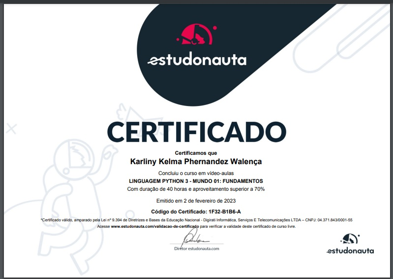

# Exercícios Solucionados 

Compilado de exercícios e respostas em linguagem Python, proposto pelo [Curso em Vídeo](https://www.cursoemvideo.com/). Ministrado pelo professor [Gustavo Guanabara](https://www.instagram.com/gustavoguanabara/).

### Sumário
#### Mundo 1 -

* [Exercício 001](https://github.com/Karliny/python_mundo1_exercicios/blob/main/ex001.py)
* [Exercício 002](https://github.com/Karliny/python_mundo1_exercicios/blob/main/ex002.py)
* [Exercício 003](https://github.com/Karliny/python_mundo1_exercicios/blob/main/ex003.py)
* [Exercício 004](https://github.com/Karliny/python_mundo1_exercicios/blob/main/ex004.py)
* [Exercício 005](https://github.com/Karliny/python_mundo1_exercicios/blob/main/ex005.py)
* [Exercício 006](https://github.com/Karliny/python_mundo1_exercicios/blob/main/ex006.py)
* [Exercício 007](https://github.com/Karliny/python_mundo1_exercicios/blob/main/ex007.py)
* [Exercício 008](https://github.com/Karliny/python_mundo1_exercicios/blob/main/ex008.py)
* [Exercício 009](https://github.com/Karliny/python_mundo1_exercicios/blob/main/ex009.py)
* [Exercício 010](https://github.com/Karliny/python_mundo1_exercicios/blob/main/ex010.py)
* [Exercício 011](https://github.com/Karliny/python_mundo1_exercicios/blob/main/ex011.py)
* [Exercício 012](https://github.com/Karliny/python_mundo1_exercicios/blob/main/ex012.py)
* [Exercício 013](https://github.com/Karliny/python_mundo1_exercicios/blob/main/ex013.py)
* [Exercício 014](https://github.com/Karliny/python_mundo1_exercicios/blob/main/ex014.py)
* [Exercício 015](https://github.com/Karliny/python_mundo1_exercicios/blob/main/ex015.py)
* [Exercício 016](https://github.com/Karliny/python_mundo1_exercicios/blob/main/ex016.py)
* [Exercício 017](https://github.com/Karliny/python_mundo1_exercicios/blob/main/ex017.py)
* [Exercício 018](https://github.com/Karliny/python_mundo1_exercicios/blob/main/ex018.py)
* [Exercício 019](https://github.com/Karliny/python_mundo1_exercicios/blob/main/ex019.py)
* [Exercício 020](https://github.com/Karliny/python_mundo1_exercicios/blob/main/ex020.py)
* [Exercício 021](https://github.com/Karliny/python_mundo1_exercicios/blob/main/ex021.py)
* [Exercício 022](https://github.com/Karliny/python_mundo1_exercicios/blob/main/ex022.py)
* [Exercício 023](https://github.com/Karliny/python_mundo1_exercicios/blob/main/ex023.py)
* [Exercício 024](https://github.com/Karliny/python_mundo1_exercicios/blob/main/ex024.py)
* [Exercício 025](https://github.com/Karliny/python_mundo1_exercicios/blob/main/ex025.py)
* [Exercício 026](https://github.com/Karliny/python_mundo1_exercicios/blob/main/ex026.py)
* [Exercício 027](https://github.com/Karliny/python_mundo1_exercicios/blob/main/ex027.py)
* [Exercício 028](https://github.com/Karliny/python_mundo1_exercicios/blob/main/ex028.py)
* [Exercício 029](https://github.com/Karliny/python_mundo1_exercicios/blob/main/ex029.py)
* [Exercício 030](https://github.com/Karliny/python_mundo1_exercicios/blob/main/ex030.py)
* [Exercício 031](https://github.com/Karliny/python_mundo1_exercicios/blob/main/ex031.py)
* [Exercício 032](https://github.com/Karliny/python_mundo1_exercicios/blob/main/ex032.py)
* [Exercício 033](https://github.com/Karliny/python_mundo1_exercicios/blob/main/ex033.py)
* [Exercício 034](https://github.com/Karliny/python_mundo1_exercicios/blob/main/ex034.py)
* [Exercício 035](https://github.com/Karliny/python_mundo1_exercicios/blob/main/ex035.py)

